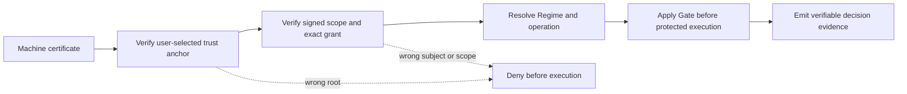

# Schemen Gate

Schemen Gate is an open enforcement library for **AI PKI**: it carries
verifier-trusted identity and signed, scoped authority to an AI execution
boundary, then emits evidence that can be checked independently. It is the
dependency-light authority and data-plane library for identity-bound binary
activation, providing immutable binary masks, cryptographic capability tokens,
lockboxes, Cargo manifests, and exact finite-operation gates without importing
a model server or control plane.

It carries both authentication and authorization to the AI execution boundary:
an organization-authenticated machine or issuer receives only its granted
Regime, and that cryptographically resolved Regime can serve as the execution
identity for a downstream battery of Gates.

The core operation is deliberately small:

```text
gated = hidden * authorized_binary_mask
```

The important part is the lifecycle around that multiply: who chooses the
mask, where the gate is placed, which state is allowed to train, and which
paths remain shared. A mask applied after ordinary training does not
retroactively create tenant-private knowledge.

Version 1.0.2 is the production-ready release candidate. The tagged Git
repository keeps the complete Gate library, PKCS#12 authority path, production
deployment contract, and reviewed CDP research and paper bundle together. The
Python wheel and source distribution contain the Gate library and its packaged
operational documentation, but intentionally exclude `research/`; the papers,
proofs, launchers, and receipts remain available at the same Git revision.
Historical research receipts retain the dependency versions recorded when they
were created; evidence is not rewritten to match the public package number.
No model server or separately installable execution service is bundled.
Research-only callback preflights ship as small, reviewable source fixtures and
make no production authority claim.

## Two minutes to working AI PKI

Run the certificate-to-Gate path from a clean clone:

```bash
python3 -m venv .venv
source .venv/bin/activate
python -m pip install --upgrade pip
python -m pip install -e '.[lockbox]'
python examples/ai_pki_quickstart.py
```

Expected PASS lines (followed by the resolved regime and gated activation):

```text
PASS: certificate -> signed grant -> resolved Regime -> Gate
PASS: wrong trust root denied before Gate
PASS: wrong recipient certificate denied before Gate
```

The example creates only ephemeral local credentials. It verifies an
independently configured authority root, proves exact grant membership and the
recipient certificate, unwraps only that recipient's Regime key, redeems its
authenticated mask token, and applies the resulting Gate. The negative paths
prove that a wrong root or wrong recipient is denied before Gate execution.

For the NumPy-only algebra in isolation, run `python examples/quickstart.py`.

## See it live

The same mechanism runs against a real co-trained digit model at
<https://demo.sekos.ai/cdp>. Pick the digit-7 tile and recognize: the answer
is unresolved because the workload holds grants for 0, 1, and 2 only, and the
recognizer for 7 never executes. Grant 7 with one click, recognize again, and
the same pixels resolve to 7 while the shared rows stay bit-identical. Five
buttons present real bad authority to the live service (wrong certificate,
tampered grant, wrong operation, unsigned grant, anonymous caller) and return
signed denial records with zero model calls. Every response is Ed25519-signed
evidence you can verify offline, and each record names the exact Gate source
commit the service runs so you can compare it with the release you install.
[`docs/DEMO_WALKTHROUGH.md`](docs/DEMO_WALKTHROUGH.md) explains every step and
the library call behind it.

## Production release candidate

Schemen Gate 1.0.2 is ready to embed as a production library when the operator
implements the deployment contract around it. The library supplies the tested,
fail-closed cryptographic boundary; the operator remains responsible for CA and
key hygiene, durable replay, runtime integrity, and closing alternate paths.

Run the complete local release verification with:

```bash
python -m pip install -e '.[crypto,lockbox,onnx,rag,spiffe,torch,dev]'
python scripts/bootstrap_build_env.py
python scripts/release_check.py
```

The bootstrap is the release build's only networked dependency-fetch phase. It
first downloads the named pip wheel as inert bytes from its fixed PyPI file URL
and checks its exact size and SHA-256 before any package installer contacts an
index. That locked pip then accepts only the explicitly enumerated universal
wheel hashes in `requirements/build.lock`.
The release checker then builds offline from a Git-tracked export, verifies
every packaged Gate source byte and the complete archive allowlist against the
reviewed commit, rejects oversized or over-compressed archive payloads before
unbounded extraction, and runs lint, the complete Gate test suite, research
checks, Lean, and clean-wheel executions of all three quickstarts. Neither command
pushes, publishes, deploys, or changes a remote repository.

Before real traffic, follow
[`docs/PRODUCTION_DEPLOYMENT.md`](docs/PRODUCTION_DEPLOYMENT.md) and run every
negative case against the actual serving boundary.

## AI PKI: AuthN and AuthZ in one path

Schemen Gate treats identity resolution, authority, and model execution as one
bounded chain:

```text
machine certificate -> external AuthN -> signed grant -> boundary AuthZ
                    -> resolved Regime -> downstream Regime AuthN
```

- **External AuthN:** verify the machine or issuer signature and certificate
  path against an independently configured trust root.
- **Boundary AuthZ:** resolve that authenticated identity to exactly the
  Regime, model, operation, scope, and lifetime named by its grant.
- **Downstream AuthN:** carry the resolved Regime as the authenticated execution
  context for subsequent Gates that verify the same bound scope.

A Regime is therefore not merely a caller-provided role or mask number. It is a
cryptographically resolved execution principal. A raw `regime_id`, prompt
string, or guessed mask never authenticates itself.



### The verifier owns the CA decision

Schemen Gate does not ship, discover, recommend, or silently select a trusted
CA. The user or operating organization supplies the root fingerprints that its
verifier trusts. Those roots may belong to a corporate PKI, private CA, public
CA, lab CA, or a deliberately pinned self-signed machine root, provided the
certificate path uses cryptography supported by the configured Gate runtime.

The software verifies the certificate path, signatures, validity, CA Basic
Constraints and Key Usage, path-length limits, signing-leaf Key Usage, supported
critical extensions, and the selected revocation policy against that
user-supplied root set. Unsupported critical certificate or CRL extensions fail
closed. It assumes the selected machine trust root is trustworthy; identity
proofing, CA operations, root distribution, rotation, and compromise response
remain the user's classical IT responsibility. There is no built-in Gate trust
store, and a credential or lockbox cannot nominate its own root as trusted.

### Public-for-all is a policy, not a failure

Maximum security is not appropriate for every resource. A public model path,
document, capability, or activation can be deliberately available to everyone.
Gate represents that decision explicitly with `GateMask.public(n_dims)`: an
all-ones policy that opens every declared coordinate. It is not a missing check,
silent fallback, or claim of tenant isolation. The mask represents that policy
explicitly; it does not authenticate who selected it. An authority-signed policy
or independently verifiable receipt can prove the difference between “public by policy”
and “accidentally bypassed.” Untrusted request input must never choose this
constructor. See [`docs/PUBLIC_FOR_ALL.md`](docs/PUBLIC_FOR_ALL.md).

## Modal in two commands

The helper enforces Modal 1.5.4 in an isolated environment, opens
Modal's official browser signup/token flow when needed, and runs one
scale-to-zero CPU canary that executes the certificate-to-grant-to-Gate path
and its wrong-root/wrong-recipient denials remotely:

```bash
./scripts/modal.sh setup
./scripts/modal.sh canary
```

The helper never asks for, prints, copies, or stores token values itself.
Modal's CLI keeps credentials in its standard user configuration outside this
repository. The canary uses no GPU and proves only account setup, image build,
source transport, remote certificate/authority/Regime/Gate execution, denial
behavior, and result transport. It does not prove a production runtime's
bypass closure or key custody.

To create a persistent proxy-authenticated CPU endpoint, run:

```bash
./scripts/modal.sh deploy-canary
```

That command asks for confirmation before creating the deployment. It does not
create or print a proxy token; manage endpoint credentials through Modal's
official workspace controls.

For commit-bound GPU evidence re-certification, current provider pricing,
cost ceilings, construction-specific receipt validation, and external artifact
custody, follow
[`docs/MODAL_RECERTIFICATION.md`](docs/MODAL_RECERTIFICATION.md). The default
compatibility campaign is estimated at $2.50-$4.00 gross with an $8.00 approval
ceiling; no research launcher is included in the two-command CPU quickstart
above.

## Understand the boundary

- [`docs/ARCHITECTURE.md`](docs/ARCHITECTURE.md) follows one request from
  workload identity through authority resolution, Gate application, operator
  execution, and evidence.
- [`docs/SECURITY_CLAIMS.md`](docs/SECURITY_CLAIMS.md) maps security claims to
  implementation and tests.
- [`docs/SECURITY_ENGINEERING.md`](docs/SECURITY_ENGINEERING.md) defines the
  trust-boundary decision inventory, independent-review rules, and enforced
  package complexity ceiling.
- [`docs/PRODUCTION_DEPLOYMENT.md`](docs/PRODUCTION_DEPLOYMENT.md) defines the
  required authority, key-custody, replay, bypass, observability, canary, and
  rollback controls.
- [`docs/LICENSING_DECISION.md`](docs/LICENSING_DECISION.md) records the
  adopted license map, patent notice, and contribution posture.
- [`docs/LAUNCH_AND_ADOPTION_PLAN.md`](docs/LAUNCH_AND_ADOPTION_PLAN.md) is the
  durable AI-PKI business, PR, channel, and adoption plan.
- [`docs/DEMO_WALKTHROUGH.md`](docs/DEMO_WALKTHROUGH.md) walks through the live
  demo request by request and maps each step to a library call.
- [`docs/CLAIM_TEST_MATRIX.md`](docs/CLAIM_TEST_MATRIX.md) links supported
  security claims to their theorem, implementation, and executable tests.
- [`docs/X509_PROFILE.md`](docs/X509_PROFILE.md) defines the exact portable
  certificate and PKCS#12 interoperability profile.
- [`docs/PUBLIC_FOR_ALL.md`](docs/PUBLIC_FOR_ALL.md) explains why public access
  is an explicit policy rather than an accidental bypass.
- [`docs/CARGO_MODE.md`](docs/CARGO_MODE.md) describes signed bilateral
  obligations and the library/operator completion boundary.
- [`docs/OPERATOR_BOUNDARY.md`](docs/OPERATOR_BOUNDARY.md) names the integration
  contract an operator must enforce around this library.
- [`ROADMAP.md`](ROADMAP.md) records release blockers and adoption work without
  presenting future work as shipped behavior.
- [`docs/POST_RELEASE_CHECKLIST.md`](docs/POST_RELEASE_CHECKLIST.md) begins only
  after deliberate publication and inventories repository, reporting, support,
  and adoption controls.
- [`docs/MODAL_RECERTIFICATION.md`](docs/MODAL_RECERTIFICATION.md) defines the
  sealed, cost-reviewed, canary-first process for re-running current
  Gate-backed Modal evidence.
- [`SECURITY.md`](SECURITY.md) is the coordinated vulnerability-reporting path.

## Research and papers

The complete Cryptographic Dimension Partitioning publication bundle lives in
[`research/cdp/`](research/cdp/README.md). It includes the LaTeX papers,
rebuilt PDFs, Lean sources, all Modal launchers, offline experiment code,
machine-readable receipts, and the claim-to-artifact inventory. The four final
PDFs and their exact sources are indexed again under “Papers and evidence”
below so a reader never has to discover the repository layout first.

The library remains Apache-2.0. The research snapshot is explicitly
multi-licensed: executable code and Lean proof source are Apache-2.0; authored
papers, documentation, figures, and designated result records are CC BY 4.0;
third-party material retains its original terms. See
`research/cdp/LICENSES.md` for the path rules and `research/cdp/SOURCE.json`
for exact source custody. Modal launchers install the current Gate source from
this repository plus a small source-visible research preflight. No other
Schemen package, executable server wheel, private Git remote, or workspace
source path is required.

## Choose the integration you actually need

| Goal | Recommended surface | What it does not claim |
|---|---|---|
| Authorize an unchanged model | Whole-model capability or operation gate | No internal model partition |
| Gate a NumPy/PyTorch activation | `GateMask` | No protection around ungated residual, cache, adapter, or runtime paths |
| Co-train all regimes in one model | Per-sample masks from the start | Shared backbone updates are shared state |
| Train tenant-private FFN state | Correctly placed FFN gate, frozen shared backbone, aligned optimizer | Shared attention is still shared |
| Preserve more private capacity | Frozen backbone plus a private adapter or expert per regime | Per-regime parameters are not free |
| Release context or vectors | Cargo or gated RAG | No partition of the downstream model's attention |
| Release encrypted model shards | Lockbox grants and scoped shard keys | No protection from a currently authorized host reading live plaintext |

If the model is already pretrained and you cannot change its training
lifecycle, start with whole-model, attachment, Cargo, or retrieval
authorization. Do not label arbitrary post-hoc head or coordinate ablation as
model isolation.

## Install version 1.0.2

### The Gate release is part of the cryptographic contract

Gate protocol schemas and Gate software releases are different version axes.
Every authenticated contract carries a `GateReleaseIdentity` containing the
package name, semantic version, canonical GitHub repository, and source commit.
That identity is covered by the same AEAD tag, HMAC, authority signature, or
public attestation as the rest of the contract. The binding applies to mask and
adapter tokens, `GateRights`, signed lockboxes, capability/attestation tokens,
Cargo manifests and receipts, and exact-operation gates.

[`release-contract.json`](release-contract.json) is the machine-readable source
for the mechanical package version, tag, and canonical repository fields.
`python scripts/validate_release_contract.py` fails if package metadata,
release tooling, CI, attestation, citation, or the research lock drifts from it.

```python
from schemen_gate import current_release_identity

release = current_release_identity()
print(release.to_dict())
release.require_source_commit()  # fail closed for an unstamped development build
```

An ordinary clean Git checkout binds `source_commit` to its exact `HEAD` and
rejects tracked, staged, or non-ignored untracked source drift. An installed
archive has no Git authority to consult, so release distributions carry the
generated commit stamp. A stale ignored stamp in a checkout is not trusted over
the verified Git commit. The release workflow stamps the already-existing
`github.sha` into the wheel and source distribution, verifies the installed
value, and—on an explicitly authorized public version tag—asks GitHub to sign a
release-admission statement for the artifact digests.
Production verifiers should compare against a verifier-owned expected
`GateReleaseIdentity`, including the full commit SHA.

A commit cannot contain its own final SHA: adding that SHA to a tracked file
would create a different commit. The generated stamp is therefore an ignored
build input, and the signed GitHub artifact attestation is external to the
commit. This is the same reason final artifact checksums and attestations are
published beside a release rather than inside the artifacts they identify.

Before publication, build and install the reviewed local candidate rather than
resolving the project name from an untrusted fallback package index:

```bash
python scripts/stamp_release.py \
  --version 1.0.2 \
  --repository https://github.com/sekosai/schemen-gate \
  --commit "$(git rev-parse HEAD)"
python scripts/bootstrap_build_env.py
python scripts/build_release.py
python scripts/verify_dist.py
shasum -a 256 dist/schemen_gate-1.0.2-py3-none-any.whl
python -m pip install 'dist/schemen_gate-1.0.2-py3-none-any.whl[lockbox]'
```

`build_release.py` rejects tracked changes, staged changes, untracked
non-ignored files, and tracked symlinks. It copies only the reviewed Git index
plus the generated commit stamp into a temporary export and invokes the locked
builder with package-index access disabled. `verify_dist.py` independently
checks exact source bytes, archive paths, dependency metadata, wheel installer
metadata, and RECORD hashes before any artifact can be attested. The complete
release checker performs the build stamp automatically. A release custodian
can verify the generated GitHub attestation after publication. The first
command verifies the artifact digest, GitHub signature, trusted signer
workflow, public runner, and exact default-branch commit. The second checks the
signed custom predicate's version, tag, source commit, and immutable CI artifact
name:

```bash
EXPECTED_GATE_COMMIT="$(git rev-parse HEAD)"
gh attestation verify dist/schemen_gate-1.0.2-py3-none-any.whl \
  --repo sekosai/schemen-gate \
  --predicate-type https://github.com/sekosai/schemen-gate/attestations/release/v1 \
  --signer-workflow sekosai/schemen-gate/.github/workflows/release-attestation.yml \
  --source-ref refs/heads/main \
  --source-digest "$EXPECTED_GATE_COMMIT" \
  --deny-self-hosted-runners \
  --format json > gate-attestation.json
jq -e --arg commit "$EXPECTED_GATE_COMMIT" '
  any(.[].verificationResult.statement;
    .predicate.schema == "schemen/gate-release-attestation-v1" and
    .predicate.package == "schemen-gate" and
    .predicate.version == "1.0.2" and
    .predicate.source_repository == "https://github.com/sekosai/schemen-gate" and
    (.predicate.source_repository_id | test("^[1-9][0-9]*$")) and
    .predicate.source_ref == "refs/tags/v1.0.2" and
    .predicate.source_commit == $commit and
    .predicate.ci_workflow == ".github/workflows/ci.yml" and
    (.predicate.ci_workflow_id | test("^[1-9][0-9]*$")) and
    (.predicate.ci_run_id | test("^[1-9][0-9]*$")) and
    (.predicate.ci_run_attempt | test("^[1-9][0-9]*$")) and
    .predicate.artifact_name == ("schemen-gate-dist-" + $commit))
' gate-attestation.json
```

See `docs/RELEASE_ATTESTATION.md` for the complete trust and verification
contract. A generic provenance check is insufficient because the privileged
`workflow_run` signer executes in GitHub's default-branch context.

After publication is explicitly authorized, install only from the canonical
package index or signed GitHub release and compare its published SHA-256 digest
before deployment. Never substitute an artifact merely because its filename
matches.

The eventual canonical package-index command will be:

```bash
python -m pip install 'schemen-gate[lockbox]==1.0.2'
```

Do not use it until the release page and package-index provenance point to the
same reviewed commit and checksums.

The core wheel depends only on NumPy. Install optional capabilities from a
checked-out source tree when developing:

```bash
python -m pip install -e '.[crypto,lockbox,onnx,rag,spiffe,torch,dev]'
```

The extras are:

- `crypto`: encrypted tokens, key wrapping, capability attestations, lockboxes,
  and operation gates. Deterministic HMAC mask derivation is available in the
  NumPy-only core.
- `torch`: tensor conversion helpers. Schemen Gate does not own your training
  loop or optimizer, and `GatedRAGAdapter` deliberately exposes no model-training
  or absorption method.
- `lockbox`: signed grants, key wrapping, and lockbox persistence.
- `onnx`: model-artifact metadata binding and attestation verification.
- `rag`: gated retrieval and optional vector-store support. `PgVectorStore`
  additionally requires the server-side PostgreSQL pgvector extension; the
  Python extra does not install database extensions.
- `spiffe`: workload identity helpers.

## Use a PKCS#12 machine identity

The lockbox extra includes `Pkcs12KeyProvider`, which consumes an already
hydrated `.p12`/`.pfx` credential containing an Ed25519, Ed448, ECDSA, or RSA
private key, leaf certificate, and certificate chain to the trust anchor:

```python
from schemen_gate import (
    Pkcs12KeyProvider,
    RevocationCheck,
    fingerprint_from_x509,
    verify_authority,
)

provider = Pkcs12KeyProvider.from_bytes(pkcs12_bytes, pkcs12_password)
lockbox.authority = provider.sign_lockbox(lockbox)

# Trust policy is user-owned and independent of the credential being verified.
# Supply fingerprints for whichever CA roots your organization has approved.
trusted_roots = [fingerprint_from_x509(approved_root_certificate_pem)]
verify_authority(
    lockbox,
    trusted_roots,
    revocation=RevocationCheck.ENFORCE,
)
```

Gate has no preferred issuer and no default CA bundle. Changing
`trusted_roots` changes the verifier's trust decision; it does not change the
Gate algorithm or require a vendor integration. The presented certificate
chain is evidence to validate, never authority to extend `trusted_roots`.

The revocation policy is mandatory: verification never silently chooses
`SKIP`. A deliberately pinned self-signed root has no issuer revocation
service, so an offline fixture may explicitly select `RevocationCheck.SKIP`;
production leaf credentials should normally use `ENFORCE` with authenticated,
fresh CRL or OCSP data. Gate performs no certificate-directed network egress
and does not ship a network fetcher. It validates the certificate's initial
endpoint syntax, rejects literal non-global destinations, applies the exact
responder-host allowlist, and rejects an oversized returned body. The required
operator-supplied fetcher owns DNS resolution, every redirect, proxy behavior,
TLS peer and connected-address validation, timeouts, response streaming limits,
and egress policy. A locked-down deployment can call
`check_certificate_revocation` with a bounded fetcher backed by an approved
local revocation service. Pass a
`RevocationPolicy` to `verify_authority`, `load_lockbox`, or the model/grant
verifiers to carry that fetcher, timeout, byte cap, and exact responder-host
allowlist through the complete trusted operation.

Issuer-signed OCSP responses are accepted directly. A delegated OCSP responder
must present an issuer-signed, currently valid OCSPSigning certificate with a
noncritical OCSP No Check extension; otherwise Gate cannot establish the
responder's own revocation contract and fails closed. Recipient revocation also
requires an authenticated issuer path anchored in `trusted_recipient_cas`.
Supplying an unpinned chain never makes it trusted. Use `SKIP` explicitly when
the operator has deliberately chosen a fingerprint-only or separately managed
recipient policy.

Run the self-contained, ephemeral example with:

```bash
python examples/pkcs12_identity.py
```

PKCS#12 is the portable credential interface, not a claim of chip residency.
The reference provider loads the signing key into process memory. An
organization may instead implement `KeyProvider` with its TPM, HSM, native
keystore, or cloud KMS when a non-exportable key handle is required.
The exact algorithms, extension handling, and tested path shapes are listed in
[`docs/X509_PROFILE.md`](docs/X509_PROFILE.md).

## First working gate

In production, an authority or trusted runtime resolves the regime. The caller
must not be allowed to choose an arbitrary mask or regime identifier.

```python
import numpy as np
from secrets import token_bytes

from schemen_gate import GateMask

# Trusted authority-side derivation. Keep this key out of request payloads,
# logs, model artifacts, and untrusted training workers.
root_key = token_bytes(32)
mask = GateMask.derive(
    key=root_key,
    regime_id=0,
    n_dims=8,
    n_regimes=2,
)

hidden = np.arange(8, dtype=np.float64)
gated = mask.apply(hidden)

assert mask.active_dims == 4
assert np.all(gated[mask.mask == 0] == 0)
assert np.array_equal(gated[mask.mask == 1], hidden[mask.mask == 1])
```

Most training workers should receive an exported mask rather than the root
key:

```python
from schemen_gate import GateMask

mask = GateMask.from_file("masks/regime_0.npy")
gated = mask.apply(hidden)
```

`GateMask` retains a private, read-only copy and rejects non-binary values.

## Training is a lifecycle choice

The Binary Activation papers report several training protocols. They answer
different questions and should not be collapsed into one generic “gated
training” recipe.

### 1. Gate-aware post-encoder co-training

Use this when all regimes may update one shared encoder and the goal is useful
support-constrained task learning. Apply each sample's gate during training so
the optimizer can learn features that survive that support.

```python
import torch

from schemen_gate import GateMask

n_dims = 768
n_regimes = 8
masks = [GateMask.from_file(f"masks/regime_{r}.npy") for r in range(n_regimes)]

# Build once per device, not inside the hot path.
gate_bank = torch.stack(
    [mask.to_torch(device="cuda", dtype=torch.float32) for mask in masks]
)

# hidden: [batch, 768]; regime_ids: [batch], authority-resolved integers.
hidden = encoder(input_ids).last_hidden_state[:, 0]
gated = hidden * gate_bank[regime_ids]
logits = classifier(gated)
loss = torch.nn.functional.cross_entropy(logits, labels)
loss.backward()
optimizer.step()
```

This is co-training: all regimes can influence the shared encoder parameters.
It measures whether the model can learn under the support constraint; it is not
evidence that the shared encoder contains separated tenant-private state.

Mixed-regime minibatches are valid because each sample receives its own mask.
An intentionally authorized union (`mask_a | mask_b`) removes the boundary
between those included supports for that invocation.

### 2. Strict FFN tenant training over a frozen public backbone

Use this when the shared Transformer is accepted as public/frozen and private
trainable state must be confined to aligned FFN slices. Place the gate on the
expanded FFN activation after the element-wise nonlinearity and immediately
before the down projection:

```python
def gated_ffn(x, up_projection, down_projection, activation, gate_mask):
    expanded = activation(up_projection(x))
    gated = gate_mask.apply(expanded)
    return down_projection(gated)
```

That multiply gives an exact local forward zero and zero loss gradient at the
inactive activation coordinates. Exact parameter-state confinement additionally
requires all of the following:

1. Freeze attention, embeddings, normalization, residual/shared parameters,
   caches, and every other path outside the declared FFN surface.
2. Align the active support with the first projection's output rows, hidden
   bias entries, and the down projection's input columns in PyTorch storage.
3. Restrict the complete optimizer update—including momentum, Adam moments,
   weight decay, and post-step transforms—to the same active slices, or restore
   inactive weights and state after every step.
4. Close ungated residual, adapter, cache, and alternate-serving bypasses.
5. Evaluate the owning key and every wrong key on the same trained model, and
   audit frozen parameters, inactive slices, optimizer state, and inactive
   classifiers for exact change.

`GateMask.apply` supplies the activation gate. It does not currently install
model hooks, freeze a backbone, or provide a masked optimizer wrapper. A normal
optimizer with decoupled weight decay can move an inactive parameter even when
its loss gradient is zero.

### 3. Public mask-aware adaptation, then frozen tenant training

A shared backbone may first be adapted on public data with all intended masks,
then frozen before tenant-stage training. The paper reports preliminary
DistilBERT evidence that this can recover utility, but the retained comparison
is not a causal estimate: extra training, distillation, and mask awareness are
confounded. Treat this as an experimental initialization protocol, not a
proven default.

Never mix tenant-private data into the public adaptation stage if the resulting
shared weights are supposed to remain public.

### 4. Frozen backbone plus private adapters or experts

Use identity-selected private lanes when dividing one fixed FFN into `R`
narrow slices costs too much utility. Freeze the shared backbone, allocate a
separate adapter, classifier, or expert to each regime, and let the trusted
authority select which attachment may load.

This restores per-regime trainable capacity at a linear storage cost. It
controls attachment reachability and inactive-lane state; it does not make the
shared attention, residual stream, caches, or logs private.

The runnable fixture at
[`examples/cotrained_shard_lockbox`](examples/cotrained_shard_lockbox/README.md)
shows gate-aware MLP co-training followed by encrypted per-regime shard release.
It is a fixture-scale protocol check, not Transformer or production evidence.

## Dimension and capacity rules

The current equal-width derivation API requires:

```text
n_dims % n_regimes == 0
```

Therefore `n_dims >= n_regimes`, and every regime receives
`n_dims / n_regimes` coordinates. Increasing `n_regimes` while holding
`n_dims` fixed reduces per-regime capacity.

If each regime needs a fixed private width `q`, design the governed layer as:

```text
n_dims = q * n_regimes
```

This preserves per-regime width but increases parameters or storage linearly.
Whole-model authorization and private attachments avoid dividing an existing
backbone, but they protect different surfaces.

## Model-training and Transformer boundaries

- Freezing a backbone prevents tenant-stage parameter updates; it does not make
  its existing representations private.
- Post-hoc masking of ordinary pretrained attention heads is a destructive
  ablation, not demonstrated Binary Activation isolation.
- The strict result governs intermediate FFN activations and aligned trainable
  state. Shared attention remains shared.
- Complete attention lanes would need separate Q/K/V, output projection,
  normalization, FFN, residual, and cache paths trained or distilled as lanes
  from the outset. That result is open.
- MoE experts are a more natural future authorization surface, but masking
  pre-softmax router logits with zero is insufficient; unauthorized experts
  must be excluded from selection and dispatch.

## Papers and evidence

The canonical manuscripts and built PDFs shipped alongside the Gate are:

- [Full manuscript source](research/cdp/paper/cdp.tex) and [PDF](research/cdp/paper/cdp.pdf)
- [Binary Activation core source](research/cdp/paper/split/binary-activation-core.tex) and [PDF](research/cdp/output/pdf/binary-activation-core.pdf)
- [Transformer boundary source](research/cdp/paper/split/binary-activation-transformers.tex) and [PDF](research/cdp/output/pdf/binary-activation-transformers.pdf)

## Authority and deployment rules

For production integrations:

- Resolve credentials to regimes in a trusted authority; do not trust a
  caller-supplied `regime_id`, mask, adapter, corpus, or tool choice.
- Bind model/version, tensor geometry, scope, operation, expiry, and policy
  context into the authority contract.
- Keep root assignment keys in the lockbox/Vault boundary. Prefer exported
  masks or scoped grants for training workers.
- Treat composed masks as explicit capability unions and audit them as such.
- Deny before model/resource execution. Computing an unauthorized output and
  multiplying it afterward is not whole-model activation.
- Make replay and exact-use limits durable in the serving layer; authenticated
  metadata alone is not an atomic usage ledger.

The complete production checklist, denial matrix, rollout sequence, evidence
fields, and bounded production claim are in
[`docs/PRODUCTION_DEPLOYMENT.md`](docs/PRODUCTION_DEPLOYMENT.md).

Schemen Gate is a library, not a serving system. It does not run HTTP servers,
store deployment credentials, load model weights, or prove that a deployment
has closed every bypass. See [OPERATOR_BOUNDARY.md](docs/OPERATOR_BOUNDARY.md).

## Security and identity FAQ

### What OS facility handles the chip binding underneath?

Gate does not require one particular OS facility. Its portable credential path
is PKCS#12 plus X.509 verification against a verifier-configured root. The
reference `Pkcs12KeyProvider` deserializes its software key into process memory;
it does not claim TPM, Secure Enclave, CNG, Pluton, Titan, confidential-
computing, or GPU-attestation guarantees. A deployment can supply a native
`KeyProvider` when hardware-backed, non-exportable signing is required.

### Which trusted-compute implementation was targeted and tested?

The tested release target is platform-agnostic PKCS#12/X.509 and software
cryptography across Ed25519, Ed448, ECDSA, and RSA authority keys. Certificate
chains may use those supported issuer-key families and may end at either a
self-signed root or an explicitly pinned non-self-signed CA trust anchor. No
vendor-specific trusted-compute backend is part of the current evidence.
Hardware custody is an integration choice at the classical IT boundary, not a
prerequisite for using the Gate.

### Is Schemen Gate authentication or authorization?

Both. The certificate and signature authenticate the external machine or
issuer. The signed scope authorizes a specific Regime. The resolved Regime then
acts as authenticated execution context for downstream Gates that consume the
same cryptographically bound scope.

### What is the security boundary?

The algebraic Gate and its modeled composition properties are proven under the
assumptions named in [`docs/SECURITY_CLAIMS.md`](docs/SECURITY_CLAIMS.md). In a
deployment, identity assurance is only as strong as the configured roots,
certificate issuance, private-key custody, rotation, revocation, and bypass
closure. Gate brings AI AuthN/AuthZ to that conventional enterprise PKI
boundary; it does not replace the boundary.

### Can I use a self-signed certificate?

Yes. Pin its fingerprint out of band as an explicit trust decision. This proves
possession and continuity of the pinned key. It does not create an independent
third-party identity assertion, and a bundle cannot nominate its own root as
trusted.

### Which CA does Schemen Gate require?

None. The verifier supplies the exact root fingerprints it trusts, and Gate
verifies against that set. Selecting and operating those roots is the user's
responsibility; Gate's software boundary assumes the selected machine root is
trustworthy.

## Other primitives

The package is broader than `GateMask`:

- [Capability delegations](tests/test_capability.py) bind separate
  policy-signing and runtime-result
  identities. Enforced consumers must use `verify_enforced_delegation`; the
  historical v1 `derive_policy_key(delegation.signature)` path is forgeable
  because the signature is public.
- [Lockboxes](examples/cotrained_shard_lockbox/README.md) wrap
  recipient-specific grants and support signed provenance, revocation state,
  and scoped key release. Consumer provenance verification first proves that
  the presented grant is an exact canonical member of the authority-signed
  lockbox; a detached or cross-lockbox grant cannot borrow that authority.
- [Cargo manifests](tests/test_cargo.py) authorize vectors or context before
  release to an ordinary model. Client keys and manifest AAD bind tenant,
  subject, regime, model, operation, policy version, and the exact partition;
  changing any one of them fails closed. The operation is a finite capability:
  `load`, `retrieve`, or the explicit `load_and_retrieve` union. Each session
  method checks that capability and the live partition-to-Regime binding before
  it calls the storage adapter. Load payloads must match the signed payload
  family, item count, embedding dimensions, finite-number requirements, and
  bounded strict-JSON representation. A declared load must complete exactly
  once before the bus can issue a success receipt. If the signed items declare
  document IDs, the store must return those exact IDs in the same positions;
  replacement IDs fail before completion is receipted.
  Receipt keys and verification bind the same complete expected manifest.
  Retrieval receipts hash the resolved query, request contract, ordered returned
  records, and returned vector material. Untrusted store results are revalidated
  for exact partition, requested kind, dimensions, finite scores/vectors, and
  bounded metadata before release. When a `VectorBridge` is used, the Gate is
  applied in the authenticated source space before projection; public vectors,
  masks, metadata, and provenance identifiers are detached copies.
  Session transitions are serialized, and Cargo loads require an all-or-nothing
  `insert_many` store operation so a partial write cannot produce a misleading
  receipt. The PostgreSQL adapter also serializes complete transactions and
  queries on its shared connection. The default bus signs only completion state
  it can evaluate itself (currently TTL expiry); caller-signaled completion
  kinds fail closed.
  Cross-process replay prevention belongs in a durable serving store.
- [Exact finite-operation gates](tests/test_operation_gate.py) authenticate a
  complete native transition contract and redeem once. They do not infer the
  semantics of user-defined symbols or grant learned execution authority.
- [Fail-closed defaults](docs/FAIL_CLOSED_DEFAULTS.md) require verifier-owned
  signer keys, finite default lifetimes, explicit Gate and storage scope,
  exact wire metadata, and exact-host revocation policy. Integrity-only
  inspection is available only through APIs named `*_self_consistency`.
- [Gated RAG](tests/test_security_hardening.py) controls partition
  ingest/retrieval. It supports only `CachePolicy.NONE` and deliberately has no
  model-training or absorption method because an arbitrary optimizer cannot be
  proven support-restricted. The downstream generator and any audited training
  loop remain separate capability and trust boundaries.
- [`fold_vector`](src/schemen_gate/_regime0_fold.py) is a lossless row codec,
  not a Gate or storage-confinement mechanism. It applies no mask and grants no
  write authority; callers must enforce those boundaries separately.

Public entry points are grouped in
[`schemen_gate.__init__`](src/schemen_gate/__init__.py). Executable contract
examples are indexed in [`examples/README.md`](examples/README.md), with
adversarial coverage in [`tests`](tests/). The supported 1.x public surface,
schema-version boundary, and deprecation rules are defined in
[`docs/API_STABILITY.md`](docs/API_STABILITY.md).

## `GateMask` reference

| Constructor | Purpose |
|---|---|
| `GateMask.from_file(path, regime_id=...)` | Load an authority-exported `.npy` mask; `regime_id` must be supplied directly or by its JSON sidecar |
| `GateMask.from_indices(indices, n_dims)` | Build an explicit mask for tests or trusted tooling |
| `GateMask.from_numpy(array)` | Validate and copy an existing binary array |
| `GateMask.from_dict(data)` | Reconstruct a JSON-safe export containing explicit `regime_id` |
| `GateMask.derive(key, regime_id, n_dims, n_regimes)` | Derive one equal-width keyed partition using the NumPy-only core |
| `GateMask.public(n_dims)` | Explicit all-ones public-for-all policy; not a tenant-isolation control |
| `GateMask.full(n_dims)` | Backward-compatible alias for `GateMask.public` |

| Method | Purpose |
|---|---|
| `.apply(hidden)` | Element-wise gate for NumPy, Torch, or compatible tensors |
| `.mask` | Return a detached, read-only owning copy of the binary mask |
| `.to_torch(device, dtype)` | Create an independent Torch tensor |
| `.to_numpy()` | Return a writable copy |
| `np.asarray(mask)` | Standard NumPy array protocol; always detached |
| `np.from_dlpack(mask)` | Standard DLPack interchange; exports detached storage |
| `.to_dict()` | Serialize active indices and metadata |
| `.save(path)` | Save `.npy` plus an optional JSON sidecar |
| `mask_a \| mask_b` | Create an explicit union of same-width supports |

## Claims and evidence

The exact statement is local: a binary Hadamard/Schur product produces zero at
an inactive coordinate of the declared tensor. Gradient and aligned-state
claims depend on correct placement and a conforming complete optimizer update.
They do not establish statistical independence, complete-model privacy, or
deployment integrity.

[SECURITY_CLAIMS.md](docs/SECURITY_CLAIMS.md) maps implementation paths to the
bundled Lean sources and labels proof, cryptographic-assumption, and empirical
claims. The publication-facing proof inventory and build configuration are
included under `research/cdp/`; claims that depend on unshipped historical
modules remain explicitly excluded.

The current security disposition is the executable claim-to-test map in
[`docs/CLAIM_TEST_MATRIX.md`](docs/CLAIM_TEST_MATRIX.md), the complete passing
test suite, and `scripts/release_check.py`. Iterative internal review notes are
not part of the public product contract.

## Development

```bash
python -m pip install -e '.[crypto,lockbox,onnx,rag,spiffe,torch,dev]'
python -m pytest -q
python -m ruff check src tests examples scripts research/cdp/experiments research/cdp/scripts research/cdp/examples
python scripts/validate_release_contract.py
python scripts/check_pypi_readme.py
python scripts/bootstrap_build_env.py
python scripts/build_release.py
python scripts/verify_dist.py
python scripts/release_check.py
```

The `--require-history-free` mode is reserved for validating a replacement
single-root bootstrap snapshot, not an ordinary release after the public line
has begun:

```bash
python scripts/release_check.py --require-history-free
```

That mode requires the current branch to be the only Git ref; rejects extra
all-ref reachable commits, including commits retained by a branch, tag, remote,
or replacement ref; rejects reflogs naming an earlier commit; and rejects
unreachable or dangling Git objects. If the final root commit needs to change,
rebuild a fresh repository; do not amend it and copy the resulting `.git`
directory.

The deterministic release suite does not download an embedding model. To run
the optional real-encoder integration after making its pinned model available:

```bash
SCHEMEN_RUN_REAL_ENCODER=1 python -m pytest -q tests/test_real_encoder_dispatch.py
```

See [SECURITY.md](SECURITY.md) for vulnerability reporting,
[DEPENDENCIES.md](docs/DEPENDENCIES.md) for the dependency surface, and
[CONTRIBUTING.md](CONTRIBUTING.md) for contribution guidance.

## Patent notice

A U.S. provisional patent application was filed before release for subject
matter related to portions of Schemen Gate. The application number, unpublished
claims, filing documents, and private prosecution records are not part of this
repository.

This notice adds no separate restriction. For material licensed under
Apache-2.0, the patent license and patent-litigation termination terms are those
in [Section 3 of the Apache License 2.0](https://www.apache.org/licenses/LICENSE-2.0#patent).
CC BY 4.0 licenses the designated paper and research content under copyright
and similar rights; it does not grant patent rights. The project's
adoption-first intent is patent peace for the shipped open contribution within
Apache-2.0's defined scope.

## License

The Gate library, examples, tests, build and deployment scripts, and Lean proof
source are licensed under Apache License 2.0. See [LICENSE](LICENSE). Authored
papers, explanatory research prose, figures, and designated research-result
records use CC BY 4.0 under the path map in
[research/cdp/LICENSES.md](research/cdp/LICENSES.md). The adopted policy and
patent scope explanation are recorded in
[the licensing policy](docs/LICENSING_DECISION.md).
