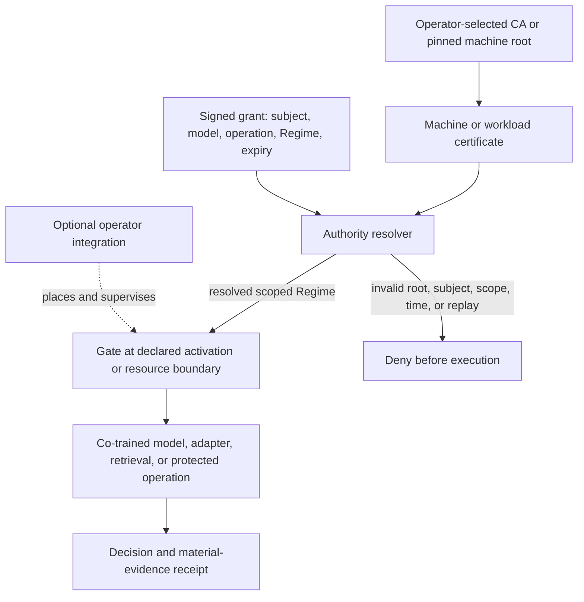
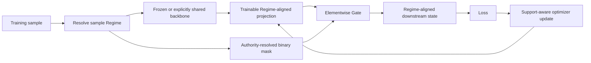

# Schemen Gate architecture

Schemen Gate is a small enforcement primitive inside a larger authority and
execution boundary. The multiply is deterministic; the security property depends
on who resolves the authority, where the gate is placed, which state may
change, and whether another path can bypass it.

## Request path



```text
caller request + workload identity
                 |
                 v
certificate verification ------ external AuthN, configured CA root
                 |
                 v
trusted authority resolver ---- boundary AuthZ, scope, expiry, revocation
                 |
                 v
resolved Regime --------------- authenticated execution identity
                 |
                 v
immutable Gate mask or scoped capability
                 |
                 v
artifact/execution boundary ---- manifest and artifact verification
                 |
                 v
declared Gate placement -------- hidden * authorized_binary_mask
                 |
                 v
result + evidence -------------- identities, hashes, decision, timing
```

The caller may request an operation, but it must not choose its own identity,
regime, mask, capability scope, or artifact. Those values come from a trusted
resolver or from an already verified, narrowly scoped capability.

The Regime has a dual role. Selecting it is an authorization decision at the
ingress boundary; after resolution it is the authenticated execution identity
for downstream Gates that verify the same signed scope. The tensor alone does
not carry identity automatically: an integration must preserve and verify the
Regime, grant, model, operation, and policy bindings along the full path.

## Classical IT trust boundary

Gate deliberately stops at the PKI boundary an IT organization already owns.
It verifies signatures and certificate paths against verifier-configured trust
roots, including explicitly pinned self-signed roots. The shipped PKCS#12
provider is a portable machine-credential adapter. It loads an Ed25519, Ed448,
ECDSA, or RSA software key into process memory and is not evidence of TPM,
enclave, measured-boot, or
confidential-computing protection. Native non-exportable key custody can be
added behind `KeyProvider` without changing the Gate or Regime contracts.
Certificate paths may end at a self-signed root or an explicitly pinned
non-self-signed CA trust anchor. See [`X509_PROFILE.md`](X509_PROFILE.md).

In this architecture, **AI PKI** means extending that configured certificate
trust boundary into signed, scoped AI execution authority and independently
checkable evidence. **AI provenance PKI** names the identity and evidence side;
**inference trust infrastructure** names the execution-enforcement side. Neither
term expands the guarantee beyond the roots, key custody, deployment integrity,
and Gate placement that the operator actually supplies.

## What the Gate library owns

- immutable binary-mask construction, validation, application, and set
  operations;
- deterministic mask derivation from trusted key material and a regime ID;
- capability, signature, canonicalization, lockbox, and Cargo primitives when
  the corresponding extras are installed;
- exact membership checks connecting a consumed grant to its signed lockbox;
- finite Cargo method authorization (`load`, `retrieve`, or their explicit
  union) before adapter access;
- exact live Cargo partition-to-Regime binding, immutable payload snapshots,
  strict payload-family and vector validation, and declared-load completion;
- validation of untrusted vector-store results before they become retrieval
  evidence or model context, including partition, kind, dimensionality,
  finiteness, order, and bounded metadata;
- Gate-before-projection semantics for bridged Cargo vectors, with detached
  public arrays, mask views, metadata, and provenance identifiers;
- exact finite-operation behavior and rejection tests; and
- serialization surfaces needed to pass a resolved mask to a worker without
  passing the root key.

## What an integration must own

- issuing and securely distributing machine and administrator identities and
  verifier trust roots;
- protecting signing keys, including any optional hardware-backed custody;
- resolving policy, scope, expiry, revocation, and replay rules;
- selecting and verifying model, adapter, dataset, and other artifacts;
- applying the Gate at the placement declared by the artifact lifecycle;
- preventing ungated routes, stale workers, shared-cache leakage, logging
  leakage, and unauthorized training updates; and
- emitting durable evidence without logging keys, bearer credentials, private
  model data, or raw secrets.

## Training lifecycles are not interchangeable

Whole-model authorization, post-encoder gate-aware co-training, strict
intermediate-FFN training, and private adapter or expert lanes have different
state boundaries. A post-hoc mask applied to an ordinary pretrained model is
an ablation unless the required lifecycle and controls were actually used.

For strict intermediate-FFN isolation, the shared backbone must be frozen and
the optimizer update—including moments and weight decay—must be restricted to
the authority-aligned support. Shared attention, residual streams, caches,
logs, and serving infrastructure remain shared unless separately governed.



Co-training is conforming only when the Gate is present from the beginning of
the declared lifecycle and every trainable parameter plus optimizer state that
is claimed private is restricted to the same support. A separately operated
execution environment can enforce artifact identity, placement, and
serving-path closure; it does not change the theorem's modeled assumptions.

## Evidence boundary

A replayable receipt can authenticate the exact manifest scope and the
canonical inputs and outputs that its schema binds. It does not prove that the
policy was wise, that the authority was entitled to act, that an unsupported
external completion event occurred, or that a deployment had no bypass. Those
claims require separately sourced identity, policy, configuration, and
integration evidence.

See [`SECURITY_CLAIMS.md`](SECURITY_CLAIMS.md) for the claim-to-test inventory
and [`../research/cdp/docs/CLAIM_BOUNDARIES.md`](../research/cdp/docs/CLAIM_BOUNDARIES.md)
for the paper's theorem, experiment, and deployment boundaries.
