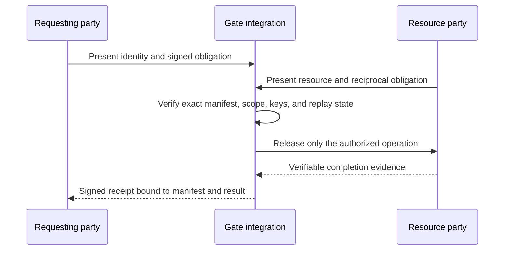

# Cargo Mode: signed bilateral work

Cargo Mode applies Gate authority to a bounded exchange of data, inference, or
work. The parties agree on a manifest before a Cargo session exists. That
manifest cryptographically binds the subject, tenant, Regime, model, operation,
policy version, embedding contract, partition, payload, release identity, and
completion conditions.

The useful idea is bilateral: one side's certificate-bound signature creates a
verifiable obligation, and the other side's accepted manifest creates the
reciprocal obligation. Completion is not a prose assertion. It occurs only
when the evidence provider named by the governed execution boundary establishes
the agreed condition.

## What the open library enforces

- exact finite operations: `load`, `retrieve`, or `load_and_retrieve`;
- authenticated manifests and receipt keys with distinct purposes;
- exact partition-to-Regime and model/embedding bindings;
- immutable payload snapshots, bounded canonical data, and material hashes;
- denial before an unauthorized storage method is called;
- signed-load completion before success can be emitted;
- process-local replay protection; and
- receipts that bind the exact expected manifest and material result.

The open library evaluates only conditions it can independently establish. Its
default session can establish its own TTL and signed-load completion. It rejects
caller-asserted payment, delivery, human approval, or external work completion.
That refusal is intentional: a string saying “done” is not evidence.

## What an operator integration adds

An operator integration can connect a completion condition to a trusted evidence
provider, durable replay store, custody boundary, or mutually authenticated
sidecar. Only that integration can claim that an external bilateral obligation
was completed. The receipt should identify the provider, evidence digest,
manifest, decision, and release commit without embedding secrets.

This separation permits flexible commerce without weakening the cryptographic
claim: anyone can define an obligation, but only a verifier the parties agreed
to can discharge it.
