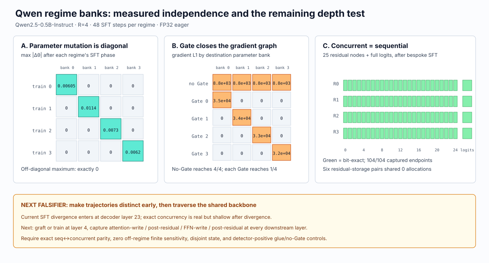
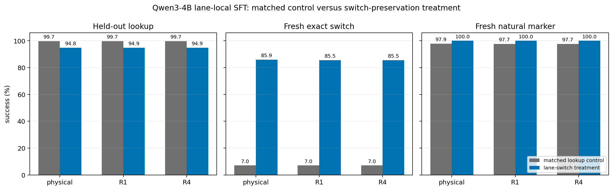
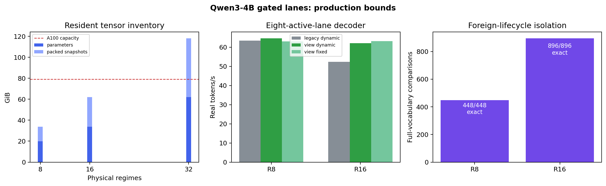
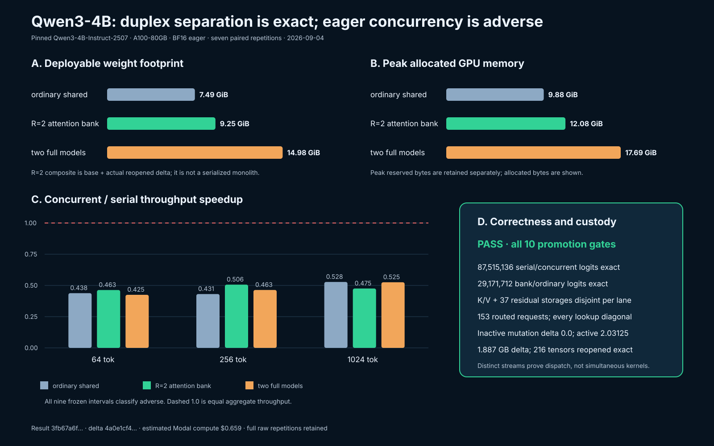

# Schemen-Gated Transformer Regime Lanes: Complete Attention with Bounded State Separation on a Shared Immutable Backbone

**Research manuscript — preprint draft, version 0.1** 
**Date:** 2026-09-05 
**Author:** Ryan McCormick, Independent Researcher 
**Evidence disposition:** controlled research baseline; not a production-security claim

## Abstract

Transformer serving commonly shares a model across requests, while model
adaptation commonly shares attention and the residual stream across adapters or
experts. Neither pattern directly answers a stricter question: can several
independently trained capability regimes remain resident behind one Transformer
backbone while each request can access only one regime's complete attention and
mutable inference state? We study a Schemen-gated architecture in which an
external authorization decision selects a canonical `(model_id, regime_id,
generation)` before any private state is indexed. Each regime owns complete
Q/K/V/O attention parameters, request-local full-width residual trajectories,
KV cache, sequence, position, mask, stopping state, and parameter generation.
Embedding, feed-forward, final-normalization, and vocabulary-projection weights
remain shared and read-only. Regime rows may be colocated in a batch, but the
architecture contains no reduction or implicit join over the regime axis.

We evaluate the construction from executable toys through pinned
Qwen2.5-0.5B-Instruct and Qwen3-4B-Instruct-2507 experiments. On Qwen3-4B,
fixed-shape interventions targeting foreign content, parameters, residual/FFN
rows, or KV state left 2,976/2,976 other-lane full-vocabulary comparisons bit
exact, while every own-lane detector changed. Four 256-step decoder
counterfactuals on two backends preserved 2,056/2,056 target comparisons. A
fresh supervised-fine-tuning confirmation trained 32 states across two corpus
draws, two order seeds, four regimes, and two matched curricula. The frozen
backbone scored 0/49,152 exact; all 96 wrong-corpus cells produced 0 foreign
answers in 147,456 opportunities; and 7,310,124 keyed accesses plus every
checkpoint transfer matched their owner maps. However, the switch-oriented
curriculum traded lookup accuracy (94.877% versus 99.707% at gated R4) for exact
post-label switching (85.547% versus 7.031%) and failed its preregistered
all-state utility gate. We therefore promote the lane architecture, not that
training recipe.

Physical R8 and R16 rosters passed 448/448 and 896/896 cached-lifecycle
comparisons with zero off-lane logit difference or argmax flips. Their measured
persistent inventories were 33.866 GiB and 61.999 GiB on an A100-80GB. An R2
attention-bank artifact was 38.27% smaller than a two-checkpoint ceiling.
Naive multi-stream eager decoding was slower in all matched controls, while
row batching improved R4 prefill at 64 and 256 tokens but not 1,024 tokens.
These results establish finite functional separation and useful parameter
sharing for the tested models, backends, shapes, corpora, and lifecycle events.
They do not establish universal noninterference, side-channel resistance,
allocator erasure, arbitrary-shape bit invariance, or production readiness.

**Keywords:** Transformer, attention, authorization, model routing, supervised
fine-tuning, KV cache, residual stream, multi-regime inference, noninterference,
Qwen

## 1. Introduction

The standard Transformer is an excellent shared computational substrate. That
strength creates a difficult boundary problem. If several organizations,
policies, tasks, or learned corpora must coexist in one deployment, which parts
of the model may be shared without allowing one regime's mutable state to enter
another regime's computation?

The most tempting answer is to assign ordinary attention heads to different
regimes. That answer is structurally incomplete. Multi-head attention projects
all head outputs into the model width through a shared output projection, adds
the result to a shared-width residual stream, and passes that stream through
the rest of the block. KV cache, positions, masks, request lifecycle, and
training state also sit outside a single head coordinate. A post-attention mask
can suppress a coordinate after some computation has already occurred, but it
does not define ownership of the complete execution path.

We instead ask a narrower, falsifiable question:

> Can an external Gate select one complete, independently mutable attention and
> state lane before access, while several lanes reuse the same immutable
> representational, feed-forward, and output operators without changing a
> matched lane's computation or admitting a foreign lane's learned corpus?

The architecture studied here treats a *regime* as a full execution lane, not
as one of the Transformer's native attention heads. At each decoder block, a
regime owns a complete attention module. During inference it also owns its
request sequence, full-width activation row, logical positions, mask, KV cache,
emitted tokens, stopping condition, and bound parameter generation. A trusted
execution-boundary decision authorizes a canonical key before the first bank lookup. The
shared backbone performs ordinary deterministic operations on the selected
lane's tensors; it never averages, sums, or otherwise joins regime rows.

This manuscript consolidates a staged research program whose frozen protocols,
failed pilots, receipts, complete denominators, figures, and dialogue appendices
remain available as a reproducibility supplement. Its contributions are:

1. **A complete-lane topology.** We specify a Gate-before-access Transformer
   construction that keeps complete attention and all mutable request state
   private while sharing immutable high-cost operators.
2. **Matched controls that distinguish coexistence from execution shape.** We
   compare ordinary native execution, gated R1, owning gated R4, physical
   R1–R32 rosters, foreign-state interventions, deliberately broken joins, and
   no-Gate mixing controls. Batch-size and padding effects are measured against
   ordinary Qwen rather than mislabeled as cross-regime learning.
3. **Independent lane-local SFT.** We retain successful and failed training
   sessions, compare repeated same-corpus training, evaluate every corpus-to-
   regime pairing, and separate lookup acquisition from post-label switching.
4. **Decoder-lifecycle and scaling evidence.** We exercise long cached decoding,
   cancellation, replacement, refresh, stale-generation refusal, row reorder,
   distinct histories, artifact size, memory, and throughput at R8 and R16,
   while retaining R32 only as a limit result.
5. **An explicit claim boundary.** The measured result is finite functional
   separation under controlled conditions. It is not a proof of information-
   theoretic isolation, hostile-process containment, or production security.

## 2. Terminology and claim

### 2.1 Native head, regime, and lane

A *native attention head* is one coordinate group inside conventional
multi-head attention. A *regime* is an authorized identity naming a complete
private capability state. A *lane* is the executable state owned by that
regime. If `R=4`, the model contains four complete attention alternatives at
each layer; it does not allocate three of four native heads to one regime or
partition the model-width coordinates four ways.

The canonical identity is

$$
k = (m, r, g),
$$

where \(m\) is model identity, \(r\) is regime identity, and \(g\) is the
parameter generation bound to a request. Sequence and cache state additionally
carry a request identity, but every lookup resolves through the same model and
regime ownership key.

### 2.2 Gate

The Gate is an external admission and selection decision. It is not a learned
sigmoid inside attention, a soft router, an attention mask, or a RoPE phase.
Given authenticated request context \(c\), the Gate either returns an admitted
key \(k\) or refuses:

$$
G(c) \rightarrow k \quad \text{or} \quad \bot.
$$

The selected key must exist before any private parameter, cache, or residual
bank is indexed. Missing, malformed, wrong-model, wrong-width, stale-generation,
and unauthorized-regime requests fail before a model callback or bank lookup.

### 2.3 Bounded functional separation

For target lane \(r\), foreign lane \(s \ne r\), target input/history \(x_r\),
and a tested foreign intervention \(P_s\), we measure:

$$
F_r(x_r; S_r, S_s) = F_r(x_r; S_r, P_s(S_s)).
$$

Equality is bitwise over the retained full-vocabulary logits when the execution
shape and backend policy are held fixed. A valid assay also requires the
positive control

$$
F_s(x_s; S_s) \ne F_s(x_s; P_s(S_s)),
$$

so a zero off-diagonal result cannot be explained by an inactive detector.

Matched-control equivalence asks whether the same learned state produces the
same output when installed in different roster constructions:

$$
F_{r,\,R=1}(x_r; S_r) \stackrel{?}{=} F_{r,\,R=n}(x_r; S_r).
$$

This is tested separately from changing batch size, padding width, kernel
selection, or numerical backend. Those changes can alter floating-point
reduction order even in ordinary ungated Qwen.

### 2.4 What the claim does not mean

The claim is not that regime A can answer only questions from corpus A. The
shared pretrained backbone retains its ordinary language capabilities. The
testable negative is narrower: A did not receive B, C, or D's private mapping
during lane-local SFT, and foreign private state did not affect A under the
specified counterfactuals. Likewise, zero observed foreign answers is not a
cryptographic secrecy proof or a statement about timing and hardware side
channels.

## 3. Architecture

### 3.1 Gate-before-state execution

For layer \(\ell\), let \(h_\ell^k\) be the request-owned full-width residual,
\(A_\ell^r\) the complete attention operator for regime \(r\), and
\(C_\ell^k\), \(p^k\), and \(M^k\) its KV cache, logical positions, and mask.
One block computes, schematically,

$$
u_\ell^k = N_{\ell,a}^r(h_\ell^k),
$$

$$
a_\ell^k, C_{\ell,\mathrm{new}}^k =
A_\ell^r(u_\ell^k, C_\ell^k, p^k, M^k),
$$

$$
\tilde h_\ell^k = h_\ell^k + a_\ell^k,
$$

$$
h_{\ell+1}^k = \tilde h_\ell^k +
\operatorname{FFN}_\ell(N_{\ell,f}^r(\tilde h_\ell^k)).
$$

The private attention operator contains the checkpoint's complete Q, K, V, and
O projections and native grouped-query head structure. RoPE is applied normally
inside the selected attention computation; no frequency, phase, scale, or
position law is repurposed as authority. In the final SFT topology, adjacent
normalization leaves at selected private blocks are also lane-local and
trainable. Earlier inference-only positioning studies kept normalization
weights shared. The distinction is preserved in their reports.

Embedding, FFN matrices, final normalization, and language-model head are
shared read-only weights. Their *activation rows* are not shared mutable state.
Each request supplies its own row, and deterministic shared operators map that
row without consulting a foreign regime's parameters or cache.

### 3.2 Complete private and shared inventory

| Component | Ownership in the promoted research topology | Reason |
|---|---|---|
| Q/K/V/O projections at every block | Regime-private | Complete attention capability and mutations must remain lane-local. |
| Selected adjacent normalization leaves | Regime-private in SFT studies | They participate in the trained private block. |
| KV cache and cache length | Request- and regime-private | Persistent autoregressive history. |
| Residual trajectory and intermediate rows | Request- and regime-private | Full-width mutable execution state, even when rows share a backing batch allocation. |
| Token sequence, valid span, positions, masks | Request- and regime-private | Prevents history or transport metadata from becoming an implicit join. |
| Emitted tokens, EOS/stopping state | Request- and regime-private | Required for independent free-running decoders. |
| Parameter generation and optimizer state | Regime-private | Refresh and SFT must not mutate another lane or silently alter an in-flight request. |
| Embedding, frozen FFN, final normalization, LM head | Shared read-only | Reused computation; no regime-axis reduction. |
| Vocabulary/tokenizer | Shared | Common symbol set does not imply common learned private mapping. |

Residual activations are not duplicated model weights. They are separate
full-width request trajectories. The KV cache is persistent decoder state and
is banked explicitly. Optimizer masters and moments are private training state;
they are not required in a minimal inference artifact.

### 3.3 Row multiplexing is not a join

For a roster \(K = \{k_1,\dots,k_b\}\), a grouped forward may concatenate
nonoverlapping rows:

$$
H_\ell = h_\ell^{k_1} \oplus \cdots \oplus h_\ell^{k_b}.
$$

Here \(\oplus\) is placement along the batch axis, not summation. Each row uses
its owning private attention parameters and cache; the shared FFN applies a
batched matrix operation and returns independently addressable rows. An
authorized semantic join would be a separate named operation. No such join is
present in these experiments.

The distinction matters because one backing allocation can safely hold
nonoverlapping row views, while an accidental mean, sum, alias, or wrong-row
index creates causal influence. The experiments therefore include deliberate
broken joins and storage-alias probes as detector-positive controls.

### 3.4 SFT availability

Each regime can be trained independently. A lane-local optimizer enumerates
only that regime's selected private parameters and private normalization leaves.
The frozen shared embedding, FFN, and vocabulary weights receive no updates.
Checkpoints retain BF16 model leaves, FP32 master weights, FP32 AdamW moments,
RNG states, trainable-module inventory, corpus identity, model revision, epoch
and step count, and parameter-generation metadata. Reopening compares tensor
bytes and identities before evaluation. A resumed update must reproduce the
physical standalone update and leave all other parameter versions, gradients,
and logits unchanged.

## 4. Relation to prior work

The Transformer introduced multi-head self-attention followed by a shared
output projection and residual path [1]. RoPE encodes position by rotating Q/K
representations and induces relative-position structure [2]. We retain the
checkpoint's native RoPE because position representation and principal
authorization solve different problems.

Mixture-of-experts and routed-attention systems reduce compute or improve model
quality by choosing learned experts, heads, or attention operations. SwitchHead
routes attention experts to reduce attention matrices [3]; Mixture-of-Head
Attention treats native heads as experts and forms a weighted sum [4]; and
Gated Attention adds query-dependent sigmoid gating after scaled dot-product
attention [5]. These are important architectural neighbors, but their router is
part of the learned computation and their objective is not external authority
over complete residual, cache, sequence, and lifecycle state.

Attention Residuals learns input-dependent aggregation over previous depth
representations [6]. Delta Attention Residuals routes sublayer or block deltas
instead of cumulative states [7]. Those systems motivate inspection of the
entire residual path and show that depth-wise state selection can materially
change model behavior. Our use is different: the residual trajectory is owned
by an already authorized lane, and no foreign depth representation is a
candidate for implicit aggregation.

The Qwen3 technical report and model card define the base model family used in
the principal experiments [8, 9]. Our result does not modify or improve Qwen's
general benchmark quality. It studies how separately mutable attention lanes
can reuse the pinned checkpoint's immutable operators.

Adjacent Schemen Substrate work demonstrated exact attention relations,
integer-addressed selection, trained register readers, and native pre-RoPE K/V
graft oracles. It also retained failures where raw retrieval did not yield
semantic answering and where overlapping masks did not isolate state. Those
results informed the insistence on exact addressing and negative controls, but
they are not relabeled here as an implementation of regime lanes. The detailed
disposition is retained in [the results-and-corrections summary](RESULTS_AND_CORRECTIONS.md#6-substrate-receiver-inside-the-lane-bank),
with original source custody in the [evidence archive](EVIDENCE_ARCHIVE.md).

## 5. Research questions and falsifiers

The campaign was organized around five questions.

**RQ1 — Placement.** Can authorization complete before the first private
attention/state lookup while retaining all native attention heads and RoPE?

Failure occurs if an unauthorized request reaches a model callback or bank
member, if any attention coordinate is ablated, or if the gate is applied only
after private computation.

**RQ2 — Matched equivalence.** Does one selected lane produce the same logits
when dormant lanes also exist?

Failure occurs on any full-vocabulary difference in a matched same-shape test.
Cross-shape numerical changes are recorded separately against native controls.

**RQ3 — Causal separation.** Can foreign parameters, content, residual/FFN
rows, KV state, sequence, or lifecycle events alter the target lane?

Failure occurs on any target-logit change at fixed shape. Every intervention
must also change its own lane, or trigger a deliberately joined positive
control, to demonstrate assay sensitivity.

**RQ4 — Independent learning.** Can every regime learn its own corpus through
lane-local SFT without acquiring foreign mappings, and is useful standalone
learning preserved when lanes coexist?

Failure occurs if the standalone control does not learn, if the owning lane
loses the learned mapping beyond a frozen margin, if a wrong-corpus cell
produces foreign answers, or if transfer/optimizer custody differs.

**RQ5 — Practical bounds.** What memory, artifact, throughput, and decoder-
lifecycle costs appear as R grows?

The outcome is allowed to be negative. In particular, concurrency is not
declared faster merely because host calls overlap, and R32 is not promoted if
its footprint leaves inadequate workspace.

## 6. Methods

### 6.1 Staged design

The work followed an expanding falsification ladder:

1. Standard-library toy models tested Gate-before-access, complete-lane
   ownership, explicit joins, RoPE cancellation controls, and receipt integrity.
2. Qwen2.5-0.5B-Instruct established exact positioning, dormant-lane
   equivalence, mutation isolation, concurrent cached decoding, and layerwise
   propagation on a real causal language model.
3. Qwen3-4B-Instruct-2507 tested R2/R4 artifact and decoder behavior, repaired
   lane-local SFT, causal interventions across all 36 blocks, physical R1–R32
   materialization, and execution-shape controls.
4. Fresh confirmatory SFT and production-bound studies locked allocations and
   gates before execution, then retained failures rather than changing
   thresholds.

Protocols, smoke amendments, timeout amendments, negative pilots, and final
reports remain separate documents. A later successful run does not overwrite
an earlier failed hypothesis.

### 6.2 Models and execution environment

The principal model is `Qwen/Qwen3-4B-Instruct-2507` at immutable revision
`cdbee75f17c01a7cc42f958dc650907174af0554`. It has 36 decoder blocks and a
151,936-token vocabulary in the tested checkpoint. Qwen2.5-0.5B-Instruct at
revision `eaa56b503cc0a8a4d15de1dd8bd2a7e95a716be2` supplied the smaller
mechanistic bridge.

Most 4B experiments ran on Modal A100-80GB workers in eager BF16. Selected
mechanics used H200, and backend controls compared eager with SDPA policies.
Lane-local training used BF16 forward/backward with FP32 master parameters and
FP32 AdamW state. One repaired study recorded Torch 2.12.1 and Transformers
5.9.0. Exact environment, source, dependency, app, run, and artifact hashes are
retained in the individual reports rather than normalized after execution.

### 6.3 Training corpus and independent units

The final SFT confirmation crossed:

- two independently generated corpus draws (2001 and 2002);
- two dataset-order seeds (1951 and 1952);
- four regimes (A/B/C/D); and
- two matched curricula (`lookup_replay` and `switch_replay`).

This produced 32 independently trained states. Each state contained 512
randomly assigned facts, 1,536 held-out lookup wordings (three per fact), 32
fresh exact post-label switches, and 32 fresh natural switches. Training ran
12 epochs, batch size 16, learning rate `1e-4`, four selected private blocks,
and 2,304 examples per epoch.

The control and treatment used equal training counts. The lookup-replay control
devoted the additional 256 examples to lookup repetition. The switch-replay
treatment replaced those examples with 256 lane-local post-label switches.
Prompt material, allocation, and thresholds were frozen before the confirmation
call.

The independent unit for training claims is the trained state, not an
individual paraphrase. Questions are nested within states. Corpus draws provide
the main independent dataset variation; order seeds measure optimizer-order
variation and are not additional independent corpora.

### 6.4 Controls

The final control hierarchy contains:

1. **Frozen no-SFT backbone:** negative control for private random mappings.
2. **Physical standalone SFT:** successful no-Gate control for acquisition.
3. **Gated R1:** isolates wrapper/routing effects without coexistence.
4. **Owning gated R4:** tests the same state with three foreign states resident.
5. **All ordered wrong-corpus cells:** tests whether a lane emits another
   regime's private mapping.
6. **Repeated same-corpus SFT:** measures normal seed-dependent logit variation.
7. **No-Gate mixing and broken joins:** leakage-positive controls.
8. **Foreign content/parameter/residual/FFN/KV interventions:** causal
   off-diagonal tests with own-lane detector positives.
9. **Ordinary native batching and padding:** controls for floating-point
   execution-shape effects.
10. **Physical R1–R32 rosters and lifecycle events:** tests allocation, refresh,
    cancellation, replacement, and stale-generation behavior.

### 6.5 Outcomes

For one-word private mapping tasks we report stripped lowercase exact match and
micro token precision, recall, and F1. Because targets are one token/word in
these cells, aggregate precision, recall, and F1 coincide with exact accuracy.
We retain all corpus-to-regime cells, not only the diagonal.

Logit comparisons retain full-vocabulary tensors, maximum absolute difference,
centered RMS, directed KL where applicable, argmax agreement, and hashes.
Exactness means bitwise equality of the retained tensor. A *harmed fact cluster*
is a fact for which at least one wording changes from correct in the matched
control to incorrect in the compared execution.

Conditional one-sided 95% exact-binomial upper bounds were computed over 512
fact clusters. Zero harms yields approximately 0.583%; a Bonferroni-24 bound is
approximately 1.199%. These bounds condition on the trained checkpoint and an
independent-Bernoulli fact model. They are not simultaneous population
guarantees and are not generalized beyond the two corpus draws.

Throughput studies use repeated matched workloads and paired bootstrap
intervals of median ratios. Memory reporting distinguishes parameter bytes,
persistent packed snapshots, transient allocation, and serialized artifact
bytes. Provider cost numbers are configured-rate estimates, not audited
invoices.

### 6.6 Qualitative decoding

The study retained free-form conversations because exact one-word recall does
not establish a usable decoder. The main confirmation selected one fresh
natural topic per state, first at 64 tokens and then in a no-retraining
256-token follow-up. A separate R8/R16 lifecycle appendix allowed up to 512
tokens. Automated topical markers and EOS counts are reported separately from
direct review. The review was performed by one research assistant, not an
independent expert panel.

### 6.7 Evidence custody

Every final study binds the base revision, executable source hash, dependency
hashes, allocation, receipts, and result artifact. Checkpoint transfer is
verified tensor-by-tensor. Access accounting compares the complete expected
request/layer/regime map with observed entries, not only a total. The final
repository verification passed 240 tests plus both custody verifiers:
`LANE_PRESERVATION_CUSTODY=PASS` and
`SCALEUP_SOURCE_CUSTODY_AND_COMPLETION=PASS`.

Hashes establish byte identity and lineage, not scientific truth. Scientific
interpretation remains bounded by the controls and denominators above.

## 7. Results

### 7.1 Positioning without attention ablation

On Qwen2.5-0.5B-Instruct, ordinary Qwen and unmutated gated R1, R2, and every R4
lane were bit exact across 38,895,616 full-vocabulary logits. The Gate executed
before every per-layer bank index. Each regime copy retained all 14 query heads,
both grouped-query KV heads, Q/K/V/O projections, and native RoPE. An inactive
regime-3 O-projection mutation changed gated regime 0 by exactly zero, while the
same mutation changed selected regime 3 and an otherwise matched no-Gate
mean-mixed control. The no-Gate control flipped 11/256 greedy decisions.

Four concurrent regime-bound cached decodes added 5,469,696 exact sequential-
versus-concurrent logit comparisons, 864/864 diagonal attention accesses, and
empty cache/residual storage intersections for every lane pair. A regime-3
graft changed five of eight regime-3 continuation tokens while regimes 0–2
remained exact. This study established placement and assay sensitivity before
scaling to 4B; it did not establish semantic SFT utility.

### 7.2 Successful SFT control and causal influence at 4B

An early grouped-lane SFT attempt failed both owning and control recall, making
its zero F1 uninformative for preservation. The repaired study added FP32 master
updates, four trainable private blocks at depths 4, 12, 20, and 28, adjacent
private norms, broader wording, and a standalone-learning admission gate.

All six physical sessions in that repaired mechanism study reached 96/96 held-
out exact. The four owning gated lanes also reached 96/96, with precision,
recall, and F1 equal to 1.0. All 12 wrong-regime/corpus cells and the frozen
backbone scored zero. Physical and owning-lane first-token logits were bit exact
for the same saved state and scalar shape.

Repeating A's training with two additional order seeds preserved all 96 answers
but did not preserve logits: maximum full-vocabulary differences were 34.5,
17.375, and 24.125 between seed pairs. Thus SFT corpus/seed variance can be
large at the logit level even when task behavior is identical. It must not be
confused with influence from resident foreign lanes.

The fixed-shape causal battery produced the following result:

| Intervention | Cases | Own-lane detector positive | Exact other-lane comparisons |
|---|---:|---:|---:|
| Foreign content across lengths and text types | 64 | 64 | 192/192 |
| O projection, residual input, and FFN output at all 36 blocks | 864 | 864 | 2,592/2,592 |
| Retained K and V at blocks 0, 4, 18, and 35 | 64 | 64 | 192/192 |
| **Total** | **992** | **992** | **2,976/2,976** |

Every comparison covered all 151,936 vocabulary logits. Two deliberately
broken residual joins were detector-positive. Four targets on both eager and
SDPA also survived one prefill plus 256 controlled foreign-history transitions:
2,056/2,056 target comparisons were bit exact. The complete access map matched
780,732 expected accesses.

Changing execution shape produced real but controlled numerical variation.
Changing active batch size from one to two/four changed gated logits by up to
0.65625 (eager) and 0.3984375 (SDPA); ordinary Qwen changed by up to 0.5625.
Changing only a foreign row's length changed target logits by up to 0.75 eager
and 0.4375 SDPA, while native controls also changed. All tested first-token
argmaxes remained equal. This is a batch/padding arithmetic effect, not evidence
that the target learned the foreign corpus.

### 7.3 Replicated SFT and the value of retaining failures

A preregistered scale-up trained 24 states across two earlier corpus draws,
three order seeds, and four regimes. Twenty-three of 24 physical, R1, and owning
R4 states exceeded 95% held-out exact; one D checkpoint failed acquisition at
approximately 15–16% in every execution form. All 72 wrong-corpus cells scored
zero F1. Six resumed B updates exactly reproduced physical updated parameters
and left A/C/D logits, versions, and gradients unchanged. The failed D loss and
collapsed output distribution were already visible in standalone training,
which prevents attributing the failure to coexistence.

The conversation appendix exposed a second limitation. Nineteen of 24 trained
states switched cleanly to a bread explanation, while the same five physical
and R4 state pairs repeated private labels after the topic change. Matching
failure identities in standalone and R4 arms again indicate a training-state
problem, not a product of other lanes being resident.

### 7.4 Fresh matched-curriculum confirmation

The final confirmation trained 32 new states under the locked design described
in Section 6.3. Its principal outcomes are:

| Curriculum | Endpoint | Held-out lookup | Exact switch | Natural topical marker | Label-only natural responses |
|---|---|---:|---:|---:|---:|
| Lookup replay control | Physical | 24,508/24,576 (99.723%) | 36/512 (7.031%) | 501/512 (97.852%) | 9/512 |
| Lookup replay control | Gated R1 | 24,504/24,576 (99.707%) | 36/512 (7.031%) | 500/512 (97.656%) | 10/512 |
| Lookup replay control | Owning R4 | 24,504/24,576 (99.707%) | 36/512 (7.031%) | 500/512 (97.656%) | 10/512 |
| Switch replay treatment | Physical | 23,310/24,576 (94.849%) | 440/512 (85.938%) | 512/512 (100%) | 0/512 |
| Switch replay treatment | Gated R1 | 23,311/24,576 (94.853%) | 438/512 (85.547%) | 512/512 (100%) | 0/512 |
| Switch replay treatment | Owning R4 | 23,317/24,576 (94.877%) | 438/512 (85.547%) | 512/512 (100%) | 0/512 |

The task ceiling is 100%. The frozen no-SFT backbone scored 0/49,152 exact and
zero precision, recall, and F1. The explicit control is not “no training”; it is
matched-step lookup replay. The treatment changes only the content of 256
examples and produces a large switching gain with a measurable lookup tradeoff.

At owning R4, paired lookup outcomes were 23,245 both correct, 1,259 control
only, 72 treatment only, and zero both wrong. Exact switches were 36 both
correct, zero control only, 402 treatment only, and 74 both wrong. One treatment
state collapsed to 352/1,536 R4 lookups, and only 6/16 treatment states met the
strict combined switch gate. The SFT curriculum is therefore not promoted as a
free preservation recipe.

Architecture results remained positive. Across 96 wrong-corpus R4 cells, zero
of 147,456 outputs matched the foreign corpus; every off-diagonal precision,
recall, and F1 was zero. All 7,310,124 keyed accesses and all checkpoint-to-lane
transfers were exact. Treatment switching was 440/512 physical and 438/512 in
both R1 and R4, placing almost all misses in the trained endpoint rather than
coexistence.

The native/R1/R4 shapes were not universally bit exact. Thirty-five harmed
fact-cluster events occurred across 64 conditional 512-fact comparisons, with
the largest differences concentrated in the failed-acquisition state. The 1%
conditional upper-bound gate passed 14/16 control cells and 15/16 treatment
cells for each native→R4 and R1→R4 comparison. These misses bound the claim;
they are not erased by the zero foreign-corpus result.

Control and treatment SFT endpoints differed substantially, as expected from
different within-lane examples. Across 16 pairs and 3,733,979,136 compared
logit scalars, maximum differences ranged from 21.3125 to 35.6035, centered RMS
from 2.08123 to 2.65818, and first-token argmax agreement was
23,242/24,576. This measures curriculum-induced endpoint variance, not foreign-
regime influence.

### 7.5 Decoder coherence

The 64-token confirmation audit was on-topic but truncated 62/128 outputs, so a
no-retraining 256-token follow-up was run. It emitted 10,287 tokens across 128
responses: 125 reached natural EOS, all 128 passed topical markers, and none was
label-only. Direct review judged all responses interpretable and on topic,
while retaining three cap truncations, five localized factual inaccuracies,
and one same-lane lexical intrusion (`suchpearl`). There were no refusals,
paragraph loops, or foreign-regime label substitutions.

The production-bound decoder check was longer still. All 8/8 R8 and 16/16 R16
conversations reached natural EOS before a 512-token cap, emitting 1,433 and
3,001 tokens respectively. These appendices show that lanes were not locked to
one-word labels after SFT. They do not constitute an independent expert factual-
quality study.

### 7.6 R8 and R16 lifecycle separation

The production-oriented eager/A100 protocol retained private request sequence,
positions, masks, cache, residual, emitted tokens, stopping state, and parameter
generation across 64 cached steps, foreign histories, cancellation,
replacement, row reorder, refresh, and stale-generation probes.

| Roster | Exact target comparisons | Off-lane max logit difference | Argmax flips | Exact keyed accesses |
|---|---:|---:|---:|---:|
| R8 | 448/448 | 0 | 0 | 257,148 |
| R16 | 896/896 | 0 | 0 | 350,460 |

Foreign-regime refresh preserved the target continuation exactly. Refreshing
the target's own regime invalidated the old decoder state, which failed closed
on its next call; a new request bound the new generation. This is direct
lifecycle evidence, not an inference from final prose.

### 7.7 Footprint

The complete attention bank saves model-weight bytes because expensive shared
operators are not copied, but private attention and snapshots still scale with
R.

| Topology | Parameter bytes | Persistent snapshot bytes | Combined inventory |
|---|---:|---:|---:|
| R8 | 21,259,739,136 | 15,104,106,496 | 36,363,845,632 (33.866 GiB) |
| R16 | 36,362,371,072 | 30,208,212,992 | 66,570,584,064 (61.999 GiB) |
| R32 limit | 66,567,634,944 | 60,416,425,984 | 126,984,060,928 (~118.26 GiB) |

Observed post-materialization allocation was 33.921 GiB for R8 and 62.063 GiB
for R16 on a 79.251 GiB A100. R8 therefore retains substantially more workspace
headroom. R32 fit only within the tested H200 capacity and remains a resource
boundary rather than a deployment target. Persistent packed snapshots are the
largest identified removable tax.

In the R2 artifact study, one complete additional all-layer attention regime
contained 943,727,616 parameters and serialized to 1,887,478,808 bytes. Base
shards plus this reopened delta formed a 9,932,460,808-byte composite, versus a
16,089,964,000-byte two-checkpoint ceiling: a 38.27% saving. Peak allocated GPU
memory was 31.68% lower than two full model instances in that ordered process.

### 7.8 Throughput and the actual bottleneck

Separate host calls can overlap without improving device throughput. In the R2
duplex study, naive eager dispatch on two CUDA streams was adverse for ordinary
shared Qwen, the attention bank, and two full models at 64, 256, and 1,024 input
tokens. The attention-bank concurrent/serial speedup ranged from 0.463 to 0.506
at the three contexts. Because the same slowdown appeared in both controls, it
is not attributed to Schemen routing or shared-backbone interference.

Putting four regimes into one residual batch amortized shared operators and was
more promising:

| Context per lane | R4 serial prefill | R4 row-batched prefill | Speedup |
|---:|---:|---:|---:|
| 64 | 214.75 ms | 160.32 ms | 1.339× |
| 256 | 204.34 ms | 156.36 ms | 1.307× |
| 1,024 | 380.44 ms | 382.95 ms | 0.993× |

At every captured residual node, A/B/C/D row views shared a backing allocation
but occupied nonoverlapping contiguous ranges. Zeroing D's layer-4 O projection
changed D's logits by 1.15625 and left A/B/C exactly unchanged. Thus physical
colocation did not imply semantic composition.

The current R4 implementation still invokes four private attention modules
sequentially at each layer, then batches only the shared residual/FFN path. It
therefore leaves much of the long-context attention work unbatched. The next
optimization is a grouped private-attention kernel in which the regime
dimension is a batch/group axis and never a reduction axis.

At R16, replacing a transient half-roster gather with a zero-copy contiguous
view improved the tested median from 52.288 to 62.058 real tokens/s, an 18.68%
gain, and removed 0.548 GiB of transient peak allocation. Reordered rosters
retain the gather fallback. This is a selector-layout result, not a universal
fixed-shape speedup.

## 8. Mechanistic interpretation

The core result follows from a simple factorization, but the experiments are
needed to verify that the implementation actually respects it. At a fixed
shape, target output has the intended form

$$
y_r = f(x_r, C_r, \theta_r, \theta_{\mathrm{shared}}),
$$

with no \(x_s\), \(C_s\), or \(\theta_s\) argument for \(s \ne r\). Shared
matrix weights do not create cross-regime influence by their mere existence.
If A and B enter the same linear or feed-forward operator as separate batch
rows, each output row depends on its own input row and the same immutable
weights. The rows interact only if the implementation introduces a reduction,
alias, misindex, shared mutable statistic, or explicit join.

This explains three empirical observations.

First, a foreign parameter or residual mutation has exactly zero effect when
the Gate selects before lookup and row ownership is correct. The same mutation
becomes visible when its owner is selected or when a no-Gate mean/broken join is
introduced.

Second, independently trained states need not have similar logits. They are
different parameter endpoints, even with the same corpus, epochs, and final
accuracy. Large seed-to-seed and curriculum-to-curriculum logit differences are
therefore expected and are not evidence of cross-regime influence.

Third, foreign *length* can change target arithmetic without foreign *content*
entering the function. Padding width, batch shape, and kernel policy select
different floating-point execution paths. Fixed-shape canonicalization removes
this source within its tested bounds, but universal bit invariance requires a
declared serving execution contract, not only lane ownership.

RoPE is not the gate. Its rotations participate in attention within the
selected lane and depend on lane-local positions. Repurposing phase as
authority would entangle access control with representational geometry and
would not by itself own caches, residuals, sequences, or lifecycle state. The
experiments therefore preserve native RoPE and place authority outside the
attention bank.

## 9. Limitations and threats to validity

### 9.1 Finite functional evidence

The zero off-diagonal results cover enumerated interventions, corpora, prompts,
backends, roster sizes, and lifecycle events. They are not a formal proof over
all possible programs, memory corruptions, hostile extensions, or workloads.
Python code in the same process can violate ownership if it bypasses the
governed execution path. Cache alias detection and access receipts are guards, not a hostile-
process security boundary.

### 9.2 Corpus generality

The private SFT tasks use random record-to-code mappings and held-out wording.
They cleanly detect corpus crossover but do not represent broad semantic
expertise or learning of unseen facts. There are only two independent corpus
draws in the final confirmation. Large paraphrase denominators do not create
thousands of independent training replicates.

### 9.3 SFT curriculum

The switch-oriented treatment strongly improves switching but sacrifices
lookup acquisition in one state and misses the all-state threshold. The result
does not establish a universal recipe for retaining general instruction
following while installing private knowledge. A new curriculum must be tuned
on development draws and confirmed on unopened corpora without replacing the
failed denominator.

### 9.4 Numerical determinism

Ordinary and gated Qwen both vary across some batch shapes and backend policies.
Automatic SDPA showed identical-input non-repeatability on one H200 path; eager
and fixed-math SDPA retained the long-decoder comparisons. Claims of bitwise
equivalence are therefore limited to explicitly matched execution contracts.

### 9.5 Performance

The experiments do not retain a complete GPU profiler trace. Host overlap and
distinct CUDA streams do not prove useful simultaneous kernel execution. The
row-batched implementation still serializes private attention calls, and peak
memory comparisons were not always run in isolated fresh processes. R8/R16
throughput numbers are descriptive medians from one A100 worker.

### 9.6 Serving and security

Persistent multi-tenant serving, admission races, simultaneous SFT and
generation, revocation under load, distributed cache migration, allocator
erasure, arbitrary row joins, timing noninterference, and output-channel
noninterference remain unproven. Parameter-generation pinning was tested at
decoder-step boundaries; continuous hostile mutation was not.

### 9.7 Qualitative review

The retained dialogue is important evidence that the decoder is usable after
training, but it was reviewed by one research assistant. It includes factual
inaccuracies and some truncation. Independent blinded human and domain-expert
evaluation is required before a language-quality claim.

## 10. Engineering and research implications

The experiments support four practical design rules.

1. **Select before access.** A route name attached after attention is too late
   to define private computation. Authorization must precede the first private
   bank lookup and bind the request through its lifetime.
2. **Own mutable state completely.** Attention weights alone are insufficient.
   Cache, residual rows, sequence, positions, masks, stopping state, optimizer,
   and parameter generation must use the same identity.
3. **Share operators, not mutable rows.** Embedding, FFN, and output weights can
   be reused when frozen. Their inputs and outputs remain lane-owned, and any
   regime-axis reduction must be explicit and authorized.
4. **Treat separation and scheduling as orthogonal.** The architecture can be
   correct while a scheduler is slow. Batching/grouped kernels and snapshot
   layout should be optimized under unchanged mutation, alias, and lifecycle
   falsifiers.

R8 is the next reasonable service-integration target because it leaves useful
A100 workspace and passed the complete bounded lifecycle protocol. R16 is a
stress tier for memory, selector, and cohort tests. R32 is useful for exposing
linear private-state costs and backend limits, but its current approximately
127 GB persistent inventory is not a deployment target.

The next scientific experiment should not merely increase R. It should confirm
a revised SFT curriculum on new corpus draws, then combine heterogeneous
arrival/departure, natural-EOS decoding, cancellation, refresh, and grouped
private-attention kernels under one fixed serving contract. A profiler should
measure kernel occupancy and launch gaps. Independent human review should score
coherence, instruction retention, foreign-corpus substitution, and factuality
without access to lane identity.

## 11. Conclusion

This work began with a concern that Transformer heads are not safely
partitionable into independent capability regimes. The resulting architecture
does not partition them. It duplicates the complete attention operator for
each regime, gives each authorized request a complete mutable state lane, and
shares only immutable backbone operators.

Across the evaluated Qwen models, dormant lanes did not alter matched selected
computation; targeted foreign mutations did not cross the tested lane boundary;
all wrong-corpus cells remained empty; and R8/R16 cached lifecycle behavior was
exact against controls. The same work also retained its negative findings:
some execution shapes were not bit identical, naive CUDA-stream concurrency
was slower, automatic SDPA was nondeterministic in one environment, and the
switch-oriented SFT curriculum did not pass its locked combined utility gate.

The appropriate conclusion is therefore positive but bounded. Complete
Schemen-gated regime lanes are a viable controlled architecture for keeping
independently mutable attention and decoder state behind a shared immutable
Qwen backbone. The present evidence justifies an R8 production-integration
candidate and an R16 stress tier. It does not yet justify a production-security
claim, a universal noninterference theorem, or promotion of the current SFT
curriculum.

## A. Reproducibility and evidence map

The manuscript is a synthesis. The following source artifacts remain the
scientific record:

| Question | Publication summary | Complete evidence |
|---|---|---|
| Gate placement, complete attention, and layerwise propagation | [Stages 2–3](RESULTS_AND_CORRECTIONS.md#2-qwen25-05b-complete-lane-pilot) | Full logits, captured nodes, access maps, and mutation positives on the archive branch. |
| Independent SFT and causal influence | [Stages 4, 9, and 10](RESULTS_AND_CORRECTIONS.md#10-sft-repair-and-failure-mechanism) | Frozen protocols, complete test appendices, checkpoints, and counterfactual receipts in the archive. |
| Substrate receiver | [Stage 6](RESULTS_AND_CORRECTIONS.md#6-substrate-receiver-inside-the-lane-bank) | Exact receiver/oracle and failed answer-formatting endpoint in the archive. |
| 4B artifact, decoder, and batching | [Stages 7–9](RESULTS_AND_CORRECTIONS.md#7-qwen3-4b-replication) | Artifact reopen, timing rows, cache/residual checks, and failed numerical gate in the archive. |
| Replicated scale-up and R32 limit | [Stage 11](RESULTS_AND_CORRECTIONS.md#11-replicated-scale-up-and-r32-boundary) | All control cells, dialogue appendices, SDPA diagnosis, and evidence index in the archive. |
| Fresh SFT confirmation | [Stage 12](RESULTS_AND_CORRECTIONS.md#12-final-sft-preservation-confirmation) | Machine receipt, all trained-state cells, and complete conversations in the archive. |
| R8/R16 lifecycle and bounds | [Stage 13](RESULTS_AND_CORRECTIONS.md#13-r8r16-production-bounds) | Full lifecycle result and conversation appendix in the archive. |
| Promoted, failed, corrected, and withheld claims | [Final claim table](RESULTS_AND_CORRECTIONS.md#final-claim-table) and [claim ledger](CLAIM_LEDGER.md) | Exact historical wording and bytes pinned by [EVIDENCE_ARCHIVE.md](EVIDENCE_ARCHIVE.md). |

The executable small models are
[`toy_gated_delta_head.py`](toy_gated_delta_head.py) and
[`toy_multi_regime_transformer.py`](toy_multi_regime_transformer.py), with
colocated tests and sealed JSON outputs under [`results/`](results/). Compact
commands and custody identifiers are in [REPRODUCIBILITY.md](REPRODUCIBILITY.md).

## B. Planned next experiments

1. **New-corpus SFT confirmation.** Select a revised acquisition-plus-switch
   curriculum using development-only draws, then freeze it and train at least
   two unopened corpus draws with multiple order seeds. Preserve the current
   failed treatment as the historical comparator.
2. **Grouped private-attention kernel.** Stack regime Q/K/V/O weights and treat
   regime as a group axis. Compare against serial private attention at equal
   shapes for logits, mutations, cache ownership, memory, latency, and
   throughput.
3. **Heterogeneous continuous batching.** Exercise unequal prompts, independent
   EOS, row compaction, cancellation, replacement, refresh, and cache migration
   across at least R8, with serial twins and full access maps.
4. **Concurrent SFT and inference boundary.** Keep training and serving disabled
   concurrently until a copy-on-write or generation-swap protocol passes
   stale-state, partial-update, optimizer-alias, and rollback falsifiers.
5. **Independent qualitative evaluation.** Blind lane identity and arm, then
   obtain multiple human/domain-expert ratings for instruction following,
   coherence, factuality, private-corpus substitution, and refusal behavior.
6. **Adversarial and systems boundary.** Test allocator reuse, process
   separation, timing/resource contention, malformed cache import, and signed
   parameter-generation revocation. Report these separately from model-quality
   metrics.

## References

1. Vaswani, A. et al. (2017). [Attention Is All You Need](https://arxiv.org/abs/1706.03762).
2. Su, J. et al. (2021). [RoFormer: Enhanced Transformer with Rotary Position Embedding](https://arxiv.org/abs/2104.09864).
3. Csordás, R., Piękos, P., Irie, K., and Schmidhuber, J. (2023). [SwitchHead: Accelerating Transformers with Mixture-of-Experts Attention](https://arxiv.org/abs/2312.07987).
4. Jin, P., Zhu, B., Yuan, L., and Yan, S. (2024). [MoH: Multi-Head Attention as Mixture-of-Head Attention](https://arxiv.org/abs/2410.11842).
5. Qiu, Z. et al. (2025). [Gated Attention for Large Language Models: Non-linearity, Sparsity, and Attention-Sink-Free](https://arxiv.org/abs/2505.06708).
6. Kimi Team et al. (2026). [Attention Residuals](https://arxiv.org/abs/2603.15031).
7. Luo, C., Cai, Z., and Hu, J. (2026). [Delta Attention Residuals](https://arxiv.org/abs/2605.18855).
8. Qwen Team (2025). [Qwen3 Technical Report](https://arxiv.org/abs/2505.09388).
9. Qwen Team. [Qwen3-4B-Instruct-2507 model card](https://huggingface.co/Qwen/Qwen3-4B-Instruct-2507), evaluated at [revision `cdbee75f17c01a7cc42f958dc650907174af0554`](https://huggingface.co/Qwen/Qwen3-4B-Instruct-2507/commit/cdbee75f17c01a7cc42f958dc650907174af0554).
